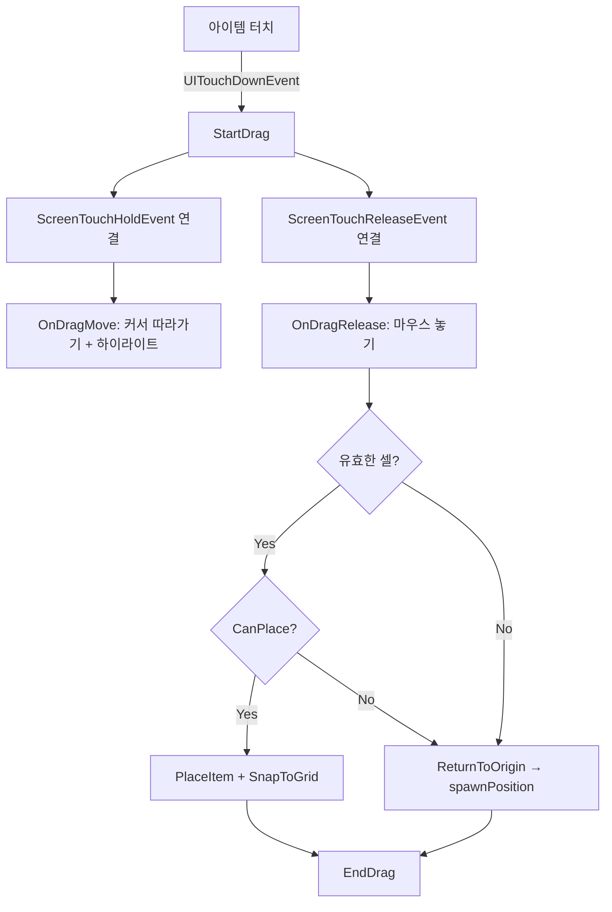

# 인벤토리 시스템 명세서

> **상태**: ✅ 기본 구현 완료  
> **작성자**: TD (Antigravity)  
> **최종 수정**: 2026-02-18

---

## 1. 개요

Backpack Hero 스타일의 그리드 기반 인벤토리 시스템.  
6×6 셀 그리드에 다양한 크기의 아이템을 드래그&드롭으로 배치한다.

## 2. 파일 구조

| 파일 | 위치 | 역할 |
|------|------|------|
| `Inventory.mlua` | MyDesk/ | 그리드 데이터 관리 (배치/제거/확장) |
| `Item.mlua` | MyDesk/ | 아이템 데이터 모델 + 터치 핸들러 |
| `InventoryUI.mlua` | MyDesk/ | UI 렌더링 + 드래그&드롭 처리 |
| `ItemTable.csv` | MyDesk/ | 아이템 마스터 데이터 |
| `InventoryTable.csv` | MyDesk/ | 인벤토리 설정 데이터 |

## 3. 엔티티 계층 구조

```
/ui/DefaultGroup/
  └─ InventoryPanel          [Inventory, InventoryUI]
      ├─ GridContainer
      │   ├─ Cell_1_1        [SpriteGUIRendererComponent]
      │   ├─ Cell_1_2        ...
      │   └─ Cell_6_6        (총 36개)
      └─ TestItem1            [Item, SpriteGUIRendererComponent, UITouchReceiveComponent]
```

## 4. 컴포넌트 상세

### 4.1 Inventory.mlua

**용도**: 6×6 그리드 데이터 관리

**Property**:
| 이름 | 타입 | 설명 |
|------|------|------|
| `grid` | `table` | 6×6 2D 배열. 0=비활성, 1=빈칸, itemId=배치됨 |
| `currentWidth` | `integer` | 현재 활성 너비 (초기 3) |
| `currentHeight` | `integer` | 현재 활성 높이 (초기 3) |
| `maxWidth` | `integer` | 최대 너비 (6) |
| `maxHeight` | `integer` | 최대 높이 (6) |
| `placedItems` | `table` | 배치된 아이템 목록 |
| `gridVersion` | `integer` | 그리드 변경 카운터 |

**Method**:
| 시그니처 | ExecSpace | 설명 |
|----------|-----------|------|
| `void OnBeginPlay()` | ClientOnly | InitGrid 호출 |
| `void InitGrid()` | ClientOnly | 중앙 기준 currentW×currentH 활성화 |
| `integer GetCellValue(integer r, integer c)` | - | 셀 값 반환 |
| `boolean CanPlace(integer r, integer c, integer w, integer h)` | - | 배치 가능 여부 |
| `void PlaceItem(integer r, integer c, integer itemId, integer w, integer h)` | - | 아이템 배치 |
| `void RemoveItem(integer itemId)` | - | 아이템 제거 |
| `void ExpandGrid(integer newW, integer newH)` | - | 그리드 확장 |

---

### 4.2 Item.mlua

**용도**: 아이템 데이터 모델 + 터치 이벤트

**Property**:
| 이름 | 타입 | 설명 |
|------|------|------|
| `itemId` | `integer` | 아이템 고유 ID (CSV 행 번호) |
| `itemName` | `string` | 이름 |
| `itemType` | `string` | 타입 (weapon/armor/consumable) |
| `width` | `integer` | 가로 칸 수 |
| `height` | `integer` | 세로 칸 수 |
| `atk/def/hp` | `integer` | 스탯 |
| `spriteRUID` | `string` | 이미지 RUID |
| `gridRow/gridCol` | `integer` | 배치 위치 (-1=미배치) |
| `spawnPosition` | `table` | 최초 생성 위치 {x, y} |
| `inventoryUIPath` | `string` | InventoryUI 엔티티 경로 (옵션) |

**Method**:
| 시그니처 | ExecSpace | 설명 |
|----------|-----------|------|
| `void OnBeginPlay()` | ClientOnly | 위치 저장 + CSV 로드 + 스프라이트 적용 + 터치 연결 |
| `void InitFromTable(integer id)` | ClientOnly | CSV에서 데이터 로드 |
| `table GetShapeCells()` | - | 아이템이 차지하는 상대 좌표 반환 |
| `void SetGridPosition(integer r, integer c)` | - | 배치 위치 설정 |
| `void ClearGridPosition()` | - | 배치 해제 |
| `boolean IsPlaced()` | - | 배치 여부 |

**이벤트**: `UITouchDownEvent` → 부모의 `InventoryUI.StartDrag()` 호출

---

### 4.3 InventoryUI.mlua

**용도**: 그리드 렌더링 + 드래그&드롭

**Property**:
| 이름 | 타입 | 설명 |
|------|------|------|
| `gridContainerPath` | `string` | GridContainer 엔티티 경로 |
| `dragLayerPath` | `string` | 드래그 레이어 경로 |
| `cellSize` | `integer` | 셀 크기 (60px) |
| `color*` | `table` | 셀 상태별 색상 (Inactive/Empty/Occupied/CanPlace/CannotPlace) |
| `cellEntities` | `table` | 셀 엔티티 참조 [row][col] |
| `dragState` | `table` | 드래그 상태 (isDragging, itemEntity, origin 등) |

**Method**:
| 시그니처 | ExecSpace | 설명 |
|----------|-----------|------|
| `void OnBeginPlay()` | ClientOnly | 초기화 |
| `void CollectCellEntities()` | ClientOnly | GridContainer에서 Cell 엔티티 수집 |
| `void RenderGrid()` | ClientOnly | 그리드 색상 렌더링 |
| `void StartDrag(Entity itemEntity)` | ClientOnly | 드래그 시작 |
| `void OnDragMove(ScreenTouchHoldEvent event)` | ClientOnly | 드래그 중 이동 |
| `void OnDragRelease(ScreenTouchReleaseEvent event)` | ClientOnly | 마우스 놓기 → 배치 시도 |
| `void TryDropItem(integer r, integer c)` | ClientOnly | 배치 시도 |
| `void ReturnToOrigin()` | ClientOnly | 실패 시 Item.spawnPosition으로 복귀 |
| `void EndDrag()` | ClientOnly | 드래그 종료 + 이벤트 해제 |
| `void SnapItemToGrid(Entity, integer r, integer c, integer w, integer h)` | ClientOnly | 아이템을 셀에 스냅 |
| `table ScreenPosToGridCell(Vector2 screenPos, integer w, integer h)` | ClientOnly | 스크린 좌표 → 시작 셀 |
| `void HighlightPlacement(integer r, integer c, integer w, integer h)` | ClientOnly | 배치 미리보기 |

---

## 5. 데이터 테이블

### ItemTable.csv
```csv
id,name,type,width,height,atk,def,hp,desc,spriteRUID
1,단검,weapon,1,2,5,0,0,기본 단검,d08c3ceb18e64a7f824d2f96a88098d7
2,나무 방패,armor,2,2,0,3,0,기본 방패,NONE
3,포션,consumable,1,1,0,0,10,HP 회복 포션,NONE
```

### InventoryTable.csv
```csv
level,width,height,desc
1,3,3,기본 인벤토리
2,4,4,확장 1단계
3,5,5,확장 2단계
4,6,6,최대 확장
```

## 6. 드래그&드롭 흐름



## 7. 미구현 항목

| 기능 | 우선순위 | 설명 |
|------|----------|------|
| 아이템 여러 개 | 🔴 높음 | 2×2, 1×1 등 다양한 크기 아이템 추가 |
| 인벤토리 확장 | 🔴 높음 | 3×3 → 4×4 → 6×6 확장 |
| 아이템 회전 | 🟡 중간 | 90도 회전으로 w↔h 교환 |
| 전투 연동 | 🟡 중간 | 배치된 아이템의 스탯 합산 |
| UI 디자인 | 🟢 낮음 | 배경, 테두리, 아이콘 등 |
